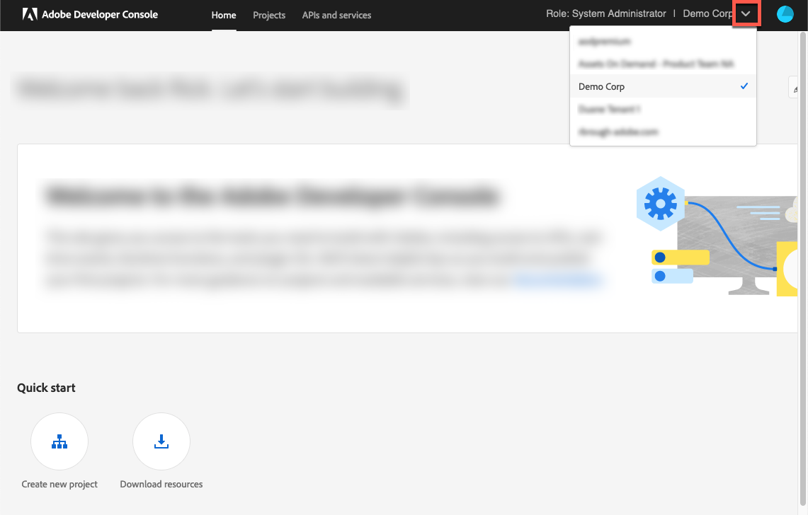

# Logga in på Adobe Analytics{#log-in-to-adobe-analytics}

Kontrollera att du är medlem i webbtjänståtkomstgruppen i Adobe Analytics. Gör det innan du loggar in för att konfigurera Adobe Analytics-rapporter och matcha Adobe Analytics rapportvariabler med Adobe Dynamic Media Classic-händelser. Medlemmar i den här gruppen har åtkomst till alla rapporter i de angivna rapportsviterna. Gör det med Experience Cloud Web Services API, oavsett vilka behörigheter som har angetts i gränssnittet. Om du vill lägga till en medlem i gruppen går du till **[!UICONTROL Admin Tools]** > **[!UICONTROL User Management]** > **[!UICONTROL Edit Groups]** i Adobe Analytics.

När du loggar in kan du ange ditt Experience Cloud-Org-ID för att använda den senaste videoanalysimplementeringen. Om du väljer att inte ange ditt ID fungerar ändå videorapportering. Det kan dock leda till att data inte integreras korrekt med andra data för klienten från andra Adobe Dynamic Media Classic.

>[!NOTE]
>
>Om ditt Adobe Analytics-konto har migrerats till Adobe IMS-baserad autentisering (Identity Management System) för inloggning fungerar inte det att ange direkta autentiseringsuppgifter.

## Logga in på Adobe Analytics från Adobe Dynamic Media Classic {#log-in-to-analytics-from-dmc}

Börja med att integrera Dynamic Media Classic med Adobe Analytics OAuth. Adobe Analytics OAuth-integrering med Dynamic Media Classic görs vanligtvis bara en gång per användare.

1. Åtkomst till [Adobe Developer Console](https://developer.adobe.com/console). Se till att ditt konto har administratörsbehörighet för organisationen som integreringen krävs för.
1. I den nedrullningsbara listan i det övre högra hörnet av hemsidan väljer du önskat företag. (Skärmbilden nedan är endast avsedd som information. Det faktiska företagsnamnet som du väljer kan variera.)

   

1. Gör något av följande:

   * Högst upp på sidan väljer du **[!UICONTROL Create a new project]** på fliken **[!UICONTROL Home]**.
   * Överst på sidan går du till fliken **[!UICONTROL Projects]**. Välj **[!UICONTROL Create a new project]** nära sidans högra hörn.

1. Välj **[!UICONTROL Add API]** på projektsidan.
1. Välj **[!UICONTROL Adobe Analytics]** på sidan **[!UICONTROL Add an API]**.
1. Välj **[!UICONTROL Next]** i sidans nedre högra hörn.

   

1. Välj **[!UICONTROL USER AUTHENTICATION OAuth]** på sidan **[!UICONTROL `Configure API`]**.
1. Välj **[!UICONTROL Next]** i sidans nedre högra hörn.
1. Välj **[!UICONTROL OAUTH 2.0 Web]** på sidan **[!UICONTROL `Configure API`]**.
1. I textfältet **[!UICONTROL Default redirect URI]** anger du följande sökväg exakt som den visas:

   `https://exploreadobe.com/dynamic-media-upgrade/`

1. I textfältet **[!UICONTROL Redirect URI pattern]** anger du följande sökväg exakt som den visas:

   `https://exploreadobe\.com/dynamic-media-upgrade/`

1. Välj **[!UICONTROL Save configured API]** i sidans nedre högra hörn.
1. På navigeringspanelen till vänster på Adobe Analytics-sidan, under **[!UICONTROL Credentials]**, väljer du **[!UICONTROL OAuth Web]**.
1. Gör följande under **[!UICONTROL Credential details]**:
   * Under **[!UICONTROL Client ID]** väljer du **[!UICONTROL Copy]** för att kopiera värdet. Du behöver det här värdet för den efterföljande Analytics-konfigurationen i Dynamic Media Classic-datorprogrammet som ska följas.
   * Under **[!UICONTROL Client Secret]** väljer du **[!UICONTROL Retrieve client secret]** för att visa det associerade värdet. Välj **[!UICONTROL Copy]** om du vill kopiera värdet. Du behöver det här värdet för den efterföljande Adobe Analytics-konfigurationen i Dynamic Media Classic-datorprogrammet som ska följas.

## Konfigurera Adobe Analytics i Adobe Dynamic Media Classic {#configure-analytics-in-dmc}

>[!NOTE]
>
>Efter din första konfiguration av Adobe Analytics i Dynamic Media Classic är den enda gången du måste göra om konfigurationen i följande fall:
>
>* En ny rapport läggs till i Analytics och användaren vill börja skicka data till den nya rapporten.
>* Spårningsservern uppdateras i Adobe Analytics.
>* En ny spårningsvariabel introduceras i en rapport och du vill länka en specifik visningsprogramvariabel i Dynamic Media Classic-användargränssnittet till den nya Analytics-variabeln.
>

1. Gå till **[!UICONTROL Setup]** > **[!UICONTROL Application Setup]** i det övre högra hörnet av Adobe Dynamic Media Classic-datorprogrammet.
1. Välj **[!UICONTROL Adobe Analytics]** under **[!UICONTROL Application Setup]** på den vänstra panelen.
1. Välj **[!UICONTROL Adobe Analytics Login]** på sidan **[!UICONTROL Adobe Analytics Configuration]**.
1. I dialogrutan **[!UICONTROL Adobe Analytics Login]**, i fältet **[!UICONTROL CLIENT ID]** och fältet **[!UICONTROL CLIENT SECRET]**, klistrar du in respektive värden som du kopierade tidigare.
1. I dialogrutans nedre högra hörn väljer du **[!UICONTROL Login]** och utför din Adobe IMS-inloggning (Identity Management Services).

   När du har loggat in visas dialogrutan Adobe Analytics-inloggning igen tillsammans med listrutan **[!UICONTROL COMPANIES]** som initierats av de företag som är tillgängliga för dig.

1. Välj ett företag i listrutan **[!UICONTROL COMPANIES]**.

   När du har valt ett företag visas den nedrullningsbara listan **[!UICONTROL SUITES]** som initierats av de rapportsviter som är tillgängliga för det valda företaget.

1. Välj en rapportsvit i listrutan **[!UICONTROL SUITES]**.

   >[!NOTE]
   >
   >Som standard måste användaren vara medveten om att listrutorna **[!UICONTROL COMPANIES]** och **[!UICONTROL SUITES]** är tomma. Användaren måste därför välja ett värde i varje lista.

1. Välj **[!UICONTROL OK]** så att du kan spara konfigurationen.

   >[!NOTE]
   >
   >Fältet **[!UICONTROL Adobe Analytics Server]** fylls i med en föreslagen tredjepartsspårningsserver som matchar ditt analysnamnutrymme när du väljer **[!UICONTROL OK]**. Om du använder en annan spårningsserver bör du uppdatera den i det här fältet för att undvika dataförlust.

1. I det nedre vänstra hörnet av konfigurationssidan för Adobe Analytics väljer du **[!UICONTROL Save]** för att se till att din Adobe Analytics-kontokonfiguration uppdateras.

>[!MORELIKETHIS]
>
>* [Konfigurera Adobe Analytics-rapporter](configuring-analytics-reports.md#configuring_adobe_analytics_reports)
